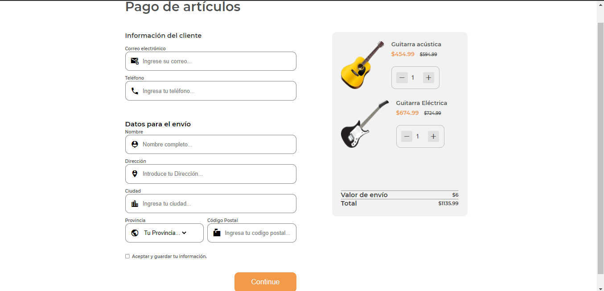

# Page-checkout-desafio 


# Pago de Artículos

Este es un formulario de pago de artículos que permite a los clientes proporcionar la información necesaria para la compra y envío de productos.

## Tabla de Contenidos

- [Descripción](#descripción)
- [Instrucciones de Uso](#instrucciones-de-uso)
- [Tecnologías Utilizadas](#tecnologías-utilizadas)
- [Contribución](#contribución)
- [Cómo Ejecutar el Proyecto](#cómo-ejecutar-el-proyecto)


## Descripción

Este proyecto consiste en un formulario interactivo que recopila la información del cliente y los detalles de envío para procesar un pedido de artículos. El formulario incluye campos para el correo electrónico, teléfono, nombre, dirección, ciudad, provincia y código postal del cliente. También muestra los productos seleccionados, sus precios y el costo de envío.


## Instrucciones de Uso

1. Completa los campos de información del cliente.
2. Ingresa los datos de envío, incluyendo nombre, dirección, ciudad, provincia y código postal.
3. Selecciona los productos que deseas comprar y ajusta la cantidad deseada.
4. Se mostrará el costo de envío y el total de la compra.
5. Asegúrate de aceptar los términos y condiciones antes de continuar.
6. Haz clic en el botón "Continuar" para finalizar el proceso de pago.

## Tecnologías Utilizadas

- HTML
- CSS
- Material Icons (para los íconos)
- [Inserta aquí otras tecnologías/frameworks utilizados]

## Contribución

Si deseas contribuir a este proyecto, sigue estos pasos:

1. Clona el repositorio.
2. Crea una nueva rama: `git checkout -b nueva-funcionalidad`.
3. Realiza tus cambios y realiza commits: `git commit -m 'Agregar nueva funcionalidad'`.
4. Sube tus cambios: `git push origin nueva-funcionalidad`.
5. Abre una solicitud de extracción en GitHub.

## Cómo Ejecutar el Proyecto

Sigue estos pasos para ejecutar el proyecto en tu entorno local:

1. **Clona el Repositorio:** Abre tu terminal y ejecuta el siguiente comando para clonar este repositorio:

   ```bash
   git clone https://github.com/TuUsuario/tu-repositorio.git
    ```
2. **Abre el Proyecto en tu Editor de Código:** Abre el proyecto en tu editor de código favorito. Si estás utilizando Visual Studio Code, puedes ejecutar el siguiente comando:

   ```bash
   cd tu-repositorio
   code .
   ```
3. **Abre el Proyecto en tu Navegador:** Abre el archivo `index.html` en tu navegador favorito y explora el proyecto.
